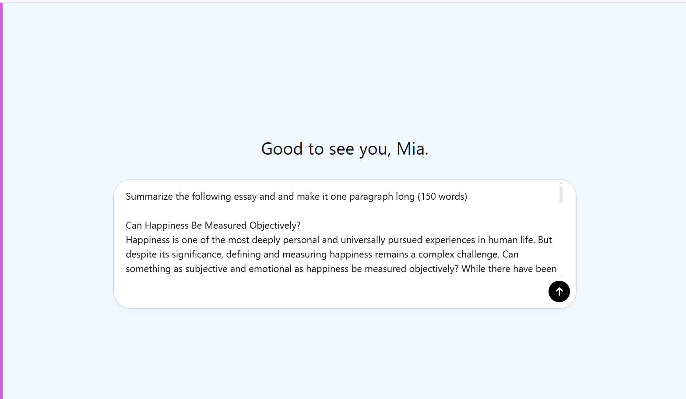
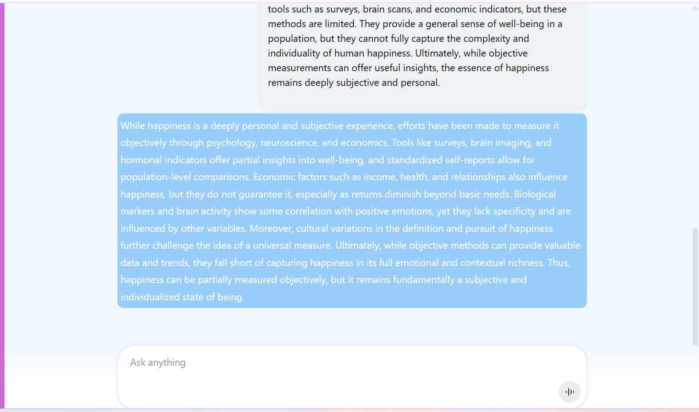
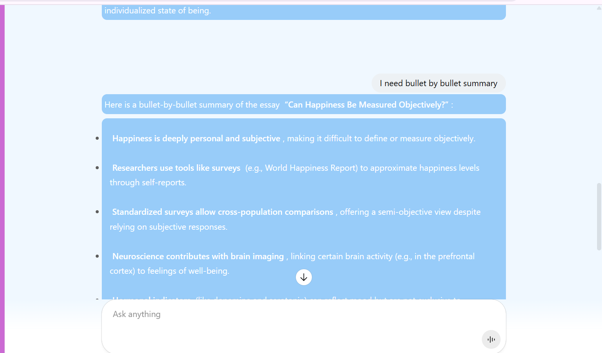

# Text Summarization

### Introduction:

This tool is designed to help users quickly understand long and complex texts such as articles, reports, academic papers, and documents. By using advanced artificial intelligence, it generates clear and concise summaries that capture the most important points. Users can get the key ideas without reading the entire text, which saves time and improves comprehension. It is useful for professionals, students, and anyone who needs to process large amounts of information efficiently.

### Scheme:

### Technical Description:

### [Examples](./Example.md)

### [Videorecording](https://drive.google.com/file/d/1A7v5vNn4uvGVa3NqGgIaP_repUSfd8dL/view?usp=sharing)

### Full Description:

#### Overview

In today's world, we're flooded with too much information, making it hard to keep up. That's why I decided to create a tool that makes reading faster and easier. My goal was to help people understand long texts like documents, articles, and reports quickly, without having to read everything. I worked on this project by myself, focusing on using advanced AI and language technology to create a tool that can automatically make short, precise summaries of lengthy texts.

#### Problem

Text summarization technology faces a big challenge today: dealing with the huge amount of information people and professionals encounter daily. There are tons of documents like academic papers, reports, and articles, making it impossible to read everything thoroughly. This overflow of information not only reduces productivity but also increases the chances of missing important points. The main problem is creating technology that can condense long texts into short, easy-to-understand summaries while keeping the main message and details intact. Achieving this requires advanced natural language processing (NLP) techniques and algorithms.

Working on this project alone for a client, I had to deal with the complexities of NLP. The main challenge with current text summarization technology is finding the right balance between brevity and completeness, ensuring the summary captures the essence of the original text without losing its meaning or skipping crucial details

#### Solution

After rigorous R&D, I engineered an advanced text summarization application, leveraging cutting-edge AI technologies. The core innovation of this tool is its algorithm, which integrates both extractive and abstractive summarization methodologies. This dual approach enables the system to identify and extract key points and concepts from texts (extractive summarization), and subsequently generate succinct, coherent summaries that encapsulate the original content's essence in novel sentences (abstractive summarization). To enhance the precision and readability of these summaries, I applied sophisticated natural language generation (NLG) techniques, meticulously optimizing the algorithm to accurately capture the context and subtleties of varied textual materials.

This tool distinguishes itself by its capacity to generate informative and accessible summaries from extensive documents, effectively condensing them into brief paragraphs without omitting critical information. It offers a viable solution to the prevalent issue of information overload, allowing users to quickly comprehend the principal elements of a document, thereby facilitating time efficiency and improved information retention.The underlying technology marks a significant advancement in NLP research and development, laying a foundational platform for future integrations into diverse applications and systems to streamline information consumption for a broad user base.

#### Process

In the development of the text summarization tool, the process unfolded in several technically intricate steps, each leveraging advanced NLP and AI methodologies to achieve an effective solution. The process can be described in the following steps:

